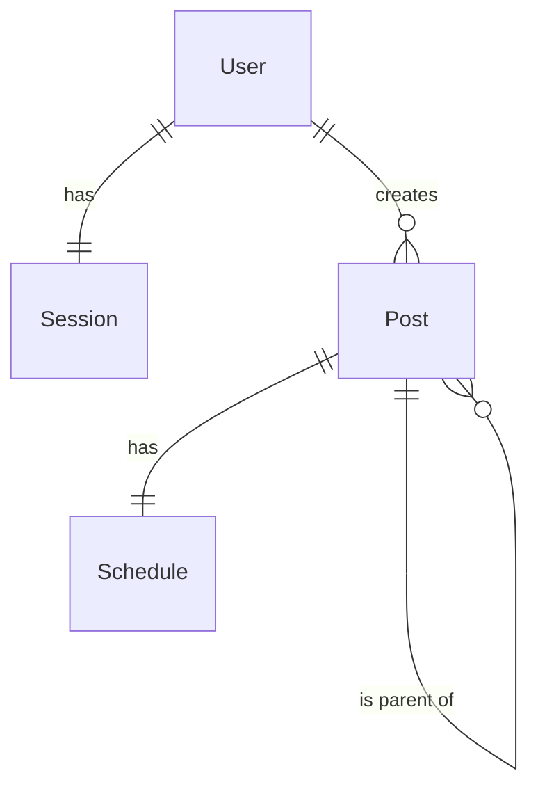

# 要件

- ユーザーは1つのセッションを持つ
- ユーザーは複数の投稿を作る事ができる
- 投稿には投稿予定日時が紐付く
- 投稿は単体、または親子関係を持つ
- システムは投稿予定時刻から、同一時刻が設定されている投稿を一覧として参照する事ができる
- ユーザーは自身が設定した投稿予定の投稿の一覧を確認することができる
- ユーザーは投稿予定を削除することができる
- システムは実行完了後に予定稿を削除する
- 指定日時に対する投稿実行のみで、繰り返しの定期投稿はしない

# モデル

| モデル      | 説明                                                                                                                   |
|----------|----------------------------------------------------------------------------------------------------------------------|
| User     | これはシステムのユーザーを表し、主キーとしてユニークな userID を持ちます。                                                                            |
| Session  | これはユーザーのセッションを表し、主キーとしてユニークな sessionID を持ちます。また、foreign key として userID を持つことで User テーブルとリンクします。                      |
| Post     | これはユーザーによって作成された投稿を表します。主キーとしてユニークな postID があり、foreign key として userID を持っています。さらに、parentPostID がある場合、それはこの投稿の親を指します。 |
| Schedule | これは投稿のスケジュールを表し、主キーとしてユニークな scheduleID を持ちます。また、foreign key として postID を持つことで Post テーブルとリンクします。                      |

# ER

