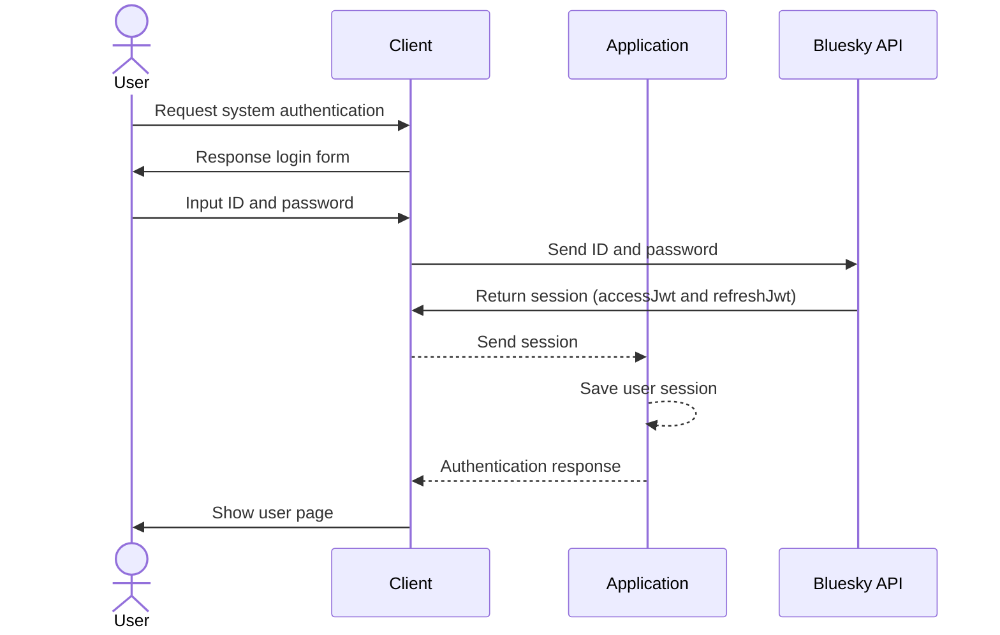
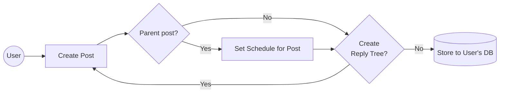

# ログイン処理

## 要件

- ユーザーはクライアントを経由し、IDとパスワードを用いシステムにログインします。
- このとき、ユーザーから直接、バックエンドにあるBluesky APIにIDとパスワードを送信します。
- Bluesky APIからセッション情報が返却されます。
	- セッションにはaccessJwtとrefreshJwtが含まれます。
- このセッションをアプリケーションサーバーに送信します。
- アプリケーションサーバーはユーザーのセッションを記録します
- ログイン後のユーザー画面を表示します。

## シーケンス図

# 予約投稿作成フロー

## 要件

- ユーザーは自身のページから投稿を作成します
	- 投稿はリッチテキストを用いて編集できます
	- 投稿はメンションリンクを埋めることができます
	- 投稿は画像を添付することができます
	- 投稿はOGPの埋め込みができます
- ユーザーは投稿予定時刻を指定することができます
- 一つの投稿に対し、1つの子を持つリプライツリーを作成することができます。
	- リプライツリーは投稿の親子関係となり、上記と投稿作成と同じ事ができます
- 投稿は保存されると、ユーザーに紐付くデータベースに格納されます

## フロー図

